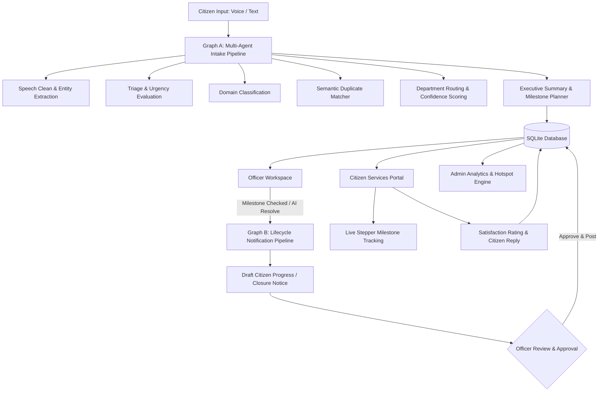

# 🏛️ AI-Powered Citizen Call Intelligence Platform

> **Hexaware Premier League — Mavericks Hackathon | Track 2: AI Citizen Intelligence**  
> *An enterprise-grade, multi-agent AI system for autonomous municipal grievance processing, real-time tracking, and citizen service delivery.*

---

## 🌟 Executive Overview

The **AI-Powered Citizen Call Intelligence Platform** revolutionizes municipal governance by combining **autonomous multi-agent AI orchestration** (powered by LangGraph) with an **enterprise-grade, restrained UI design system** (inspired by Linear, Stripe, and Notion). 

The platform enables citizens to register complaints via voice or text, receives instant AI auto-acknowledgments, monitors live vertical milestone progression, and allows municipal officers to review confidence gates, trigger autonomous remediation, or dispatch field crews with full audit transparency.

---

## 🚀 Key Capabilities & System Features

### 1. Two-Stage Multi-Agent Graph Architecture (LangGraph)

#### 🔄 Graph A: Intake & Resolution Planning Pipeline
- `📥 Intake Node`: Ingests and cleans voice/text transcripts, validates metadata, and extracts geographic entities.
- `⚖️ Triage Node`: Assesses urgency level (Emergency, High, Normal, Low) and citizen sentiment.
- `🏷️ Classification Node`: Classifies issues across municipal domains (*Electricity, Water, Roads, Police, Health, Sanitation, Transport, etc.*).
- `🔍 Semantic Duplicate Matcher`: Leverages vector embeddings (`sentence-transformers/all-MiniLM-L6-v2`) to detect duplicate issues within proximity and prevent ticket bloat.
- `🏢 Department Routing Engine`: Matches issues to official municipal authorities with routing confidence scoring.
- `📝 Executive Summarizer`: Generates structured, concise summaries for officer queues.
- `📋 Resolution Milestone Planner`: Generates an actionable step-by-step resolution checklist with ownership tags (`officer` / `department`) and SLA targets.

#### 🔄 Graph B: Lifecycle Notification & Human-in-the-Loop Pipeline
- Event-driven execution triggered when officers complete resolution milestones.
- Automatically drafts milestone progress updates and closure notices.
- **Strict Human-in-the-Loop (HITL) Gate**: AI drafts are reviewed and approved by officers before publishing to the citizen-visible timeline.

#### ⚡ Autonomous Multi-Agent Remediation Pipeline
- Autonomous execution simulating end-to-end municipal dispatch, technical remediation, QA compliance verification, and ticket closure.
- Available as a one-click action for both citizens and officers.

---

### 2. Role-Based Workspaces & Portals

#### 🚪 Role-Selection Landing Page (`/`)
- One-click role gate tailored for live demo presentations.
- Pick between **Citizen**, **Officer** (with department pre-assignment), or **Municipal Administrator**.
- Dynamic routing with filtered sidebar navigation.

#### 🏛️ Citizen Services Portal (`/citizen`)
- **Multi-Modal Intake**: Speak grievance via browser voice recorder with real-time transcription and automatic regex entity extraction for **Location/Ward** and **Email/Phone**.
- **Instant AI Auto-Response**: Immediate official acknowledgment banner outlining ticket number and assigned municipal wing.
- **Live Resolution Stepper**: Real-time vertical connected stepper tracking each operational milestone from dispatch to repair.
- **Citizen Feedback Loop**: 5-Star satisfaction rating widget with qualitative comments upon resolution.
- **Follow-up Communication**: Direct two-way messaging with the assigned case officer.
- **AI Status Assistant**: Natural language chatbot answering queries about complaint status, ETAs, and department contacts.

#### 📋 Officer Workspace (`/dashboard`)
- **Queue Triage**:
  - `📥 Active Queue`: Real-time cases with step progress chips (e.g. `✓ 2/3 steps`).
  - `⚠️ Needs Review`: Flags low-confidence routing (< 70%) and duplicate ambiguities.
  - `✅ Resolved`: Archive of completed municipal interventions.
- **Department Quick-Filter**: Toggle between `🏢 My Department` and `🌐 All Municipalities`.
- **Interactive Action Milestones**: Check off individual milestones, execute autonomous AI resolution per step, and review auto-generated citizen progress drafts.
- **Outreach & Dispatch**: One-click brief copy for field crew WhatsApp / SMS dispatch.
- **Elevated Agent Reasoning Audit Trail**: Modern micro-agent telemetry cards displaying latency (`⏱️ 142ms`), execution timestamps, and syntax-highlighted parameter inspection.
- **Full Audit Inspector**: Modal view with raw JSON audit ledger export.

#### 📊 Admin Analytics & Hotspot Intelligence (`/analytics`)
- **Key Performance Indicators**: Total volume, emergency counts, average resolution SLA hours, and resolution rate.
- **Interactive Visualizations**: Recharts-powered category distribution, urgency breakdown, and 14-day filing trends.
- **Geographic Hotspots**: Ranked density table identifying chronic civic infrastructure pain points by location and category.

---

## 🏗️ System Architecture



---

## 🎨 Enterprise Design System

The application is built on an enterprise-grade UI design system:
- **Design Tokens (`tokens.css`)**: Single source of truth for semantic colors, 4px base spacing scale, elevation shadows, and motion curves.
- **Balanced Layouts (`.workspace-grid-balanced`)**: Symmetrical 50/50 two-column distribution with full-width hero action bars.
- **Reusable Component Library (`frontend/src/components/ui/`)**:
  - `Button`: Primary, secondary, danger, and ghost variants with integrated loading states.
  - `Card`: Clean elevation surfaces with standard headers and hover transitions.
  - `Badge` / `StatusBadge` / `UrgencyBadge`: Soft-background + saturated text pairings for high contrast readability.
  - `Input` / `Select`: Accessible form components with active focus rings.
  - `PageHeader`: Standardized title, description, and action button bar.
  - `Timeline`: Vertical stepper tracking completed, in-progress, and pending milestones.
  - `FeedbackStates`: Standardized `EmptyState`, `LoadingSkeleton`, and `ErrorState`.

---

## 🚀 Getting Started

### Prerequisites
- **Python 3.10+**
- **Node.js 18+** & **npm**
- **Navigate Labs AI API Key** (or OpenAI-compatible key)

---

### Backend Setup

```bash
# 1. Navigate to backend directory
cd backend

# 2. Create and activate virtual environment
python -m venv venv
venv\Scripts\activate      # Windows
# source venv/bin/activate # macOS/Linux

# 3. Install dependencies
pip install -r requirements.txt

# 4. Configure Environment Variables
cp ../.env.example ../.env
# Ensure NAVIGATE_API_KEY is configured in .env

# 5. Seed Initial Demo Data
python -m app.seed_data

# 6. Start FastAPI Development Server
python -m uvicorn app.main:app --reload --port 8000
```
- **API Documentation (Swagger UI)**: `http://localhost:8000/docs`

---

### Frontend Setup

```bash
# 1. Navigate to frontend directory
cd frontend

# 2. Install dependencies
npm install

# 3. Start Vite Development Server
npm run dev
```
- **Frontend Application URL**: `http://localhost:5173`

---

## 🧪 Testing & Verification

### 1. Test Backend API Endpoints
```bash
cd backend
python test_api_endpoints.py
```

### 2. Test Autonomous Resolution Pipeline
```bash
cd backend
python test_autonomous_pipeline.py
```

### 3. Test Frontend Production Build
```bash
cd frontend
npm run build
```

---

## 📂 Project Structure

```
citizen-call-intelligence/
├── backend/
│   ├── app/
│   │   ├── graph/               # LangGraph Multi-Agent Workflows
│   │   │   ├── state.py         # Agent state schemas & trace structures
│   │   │   ├── nodes.py         # Graph A: Intake, Triage, Classifier, Routing, Planner
│   │   │   ├── lifecycle_nodes.py # Graph B: Progress notification & closure drafter
│   │   │   └── graph.py         # Compiled StateGraph definitions
│   │   ├── routers/             # FastAPI REST endpoints
│   │   │   ├── complaints.py    # Ingestion, analysis, auto-resolve endpoints
│   │   │   ├── citizen.py       # Citizen portal tracking, followups & chatbot
│   │   │   ├── officer.py       # Officer queues, checklists & timeline dispatch
│   │   │   └── analytics.py     # Metrics summary & geographic hotspot engine
│   │   ├── models.py            # SQLAlchemy database models
│   │   ├── database.py          # Database session configuration
│   │   ├── seed_data.py         # Mock complaints & realistic demo data
│   │   └── main.py              # Application entry point
│   ├── test_api_endpoints.py    # Automated test suite for all endpoints
│   └── test_autonomous_pipeline.py # Autonomous pipeline verification
├── frontend/
│   ├── src/
│   │   ├── api/client.ts        # Fully typed API client
│   │   ├── components/
│   │   │   ├── ui/              # Design System Component Library
│   │   │   │   ├── Button.tsx
│   │   │   │   ├── Card.tsx
│   │   │   │   ├── Badge.tsx
│   │   │   │   ├── Input.tsx
│   │   │   │   ├── PageHeader.tsx
│   │   │   │   ├── Timeline.tsx
│   │   │   │   └── FeedbackStates.tsx
│   │   │   ├── VoiceRecorder.tsx # Web Speech audio intake component
│   │   │   └── AgentAuditLogModal.tsx # Full JSON audit ledger inspector
│   │   ├── context/RoleContext.tsx # Role gate profile state & persistence
│   │   ├── pages/
│   │   │   ├── LandingPage.tsx   # Role gate login landing page
│   │   │   ├── CitizenPortal.tsx # Citizen intake, live tracking & chatbot
│   │   │   ├── OfficerDashboard.tsx # Officer queue, checklist & reasoning trace
│   │   │   └── AdminAnalytics.tsx # Metrics, Recharts & Hotspots table
│   │   ├── styles/
│   │   │   ├── tokens.css       # Authoritative design tokens
│   │   │   └── index.css        # Layouts, balanced grids & components
│   │   └── App.tsx              # Router & role-based protected routes
│   └── package.json
└── README.md
```

---

## 🏆 Hackathon Alignment

| Requirement | Implementation in Platform |
|---|---|
| **Autonomous Multi-Agent Processing** | LangGraph Graph A & B with 8+ specialized agent nodes and deterministic SLA engines. |
| **Multi-Modal Intake** | Browser speech-to-text with auto-entity extraction for ward and contact details. |
| **Actionable Resolution Planning** | Milestone planner creating owner-tagged steps with interactive execution. |
| **Human-in-the-Loop Safety** | Officer gate for reviewing and sending AI-drafted milestone updates to citizens. |
| **Audit Transparency** | Detailed agent reasoning trace cards with latency metrics and JSON audit logs. |
| **Enterprise UI Standards** | Dedicated design system tokens, 50/50 balanced grids, and accessible components. |
